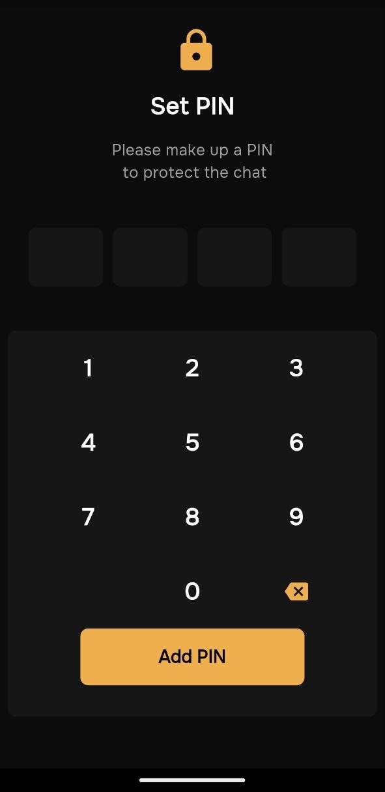
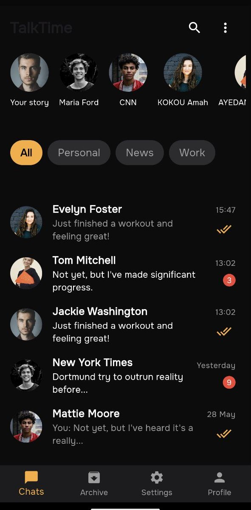
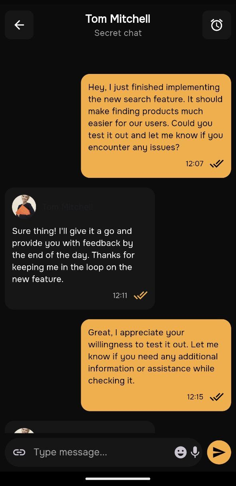

# Chat Mobile App Design Concept

This project is a Flutter implementation of a chat mobile app design concept inspired by a design on Dribbble. The goal of this project is to create a visually appealing and functional chat application using Flutter, showcasing the design skills and the power of the Flutter framework.

## Preview

Here are some screenshots of the application:





## Features

- User-friendly chat interface
- Responsive design for different screen sizes
- Modern UI elements and smooth animations

## Getting Started

To run this project on your local machine, follow these steps:

### Prerequisites

Make sure you have Flutter installed on your machine. You can download Flutter from the official website: [flutter.dev](https://flutter.dev)

### Installation

1. Clone the repository:

    ```sh
    git clone https://github.com/razalgul-git/dribbble-inspirations.git
    ```

2. Navigate to the project directory:

    ```sh
    cd dribbble-inspirations
    ```

3. Install the dependencies:

    ```sh
    flutter pub get
    ```

4. Run the app:

    ```sh
    flutter run
    ```

## Credits

This project is inspired by the beautiful design concept created by [Ronas IT | UI/UX Team](https://dribbble.com/ronasit). You can view the original design on Dribbble [here](https://dribbble.com/shots/24402486-Chat-Mobile-App-Design-Concept).

## Contributing

Contributions are welcome! If you have any suggestions or improvements, feel free to open an issue or submit a pull request.

## License

This project is licensed under the MIT License - see the [LICENSE](LICENSE) file for details.

---

Happy coding!
